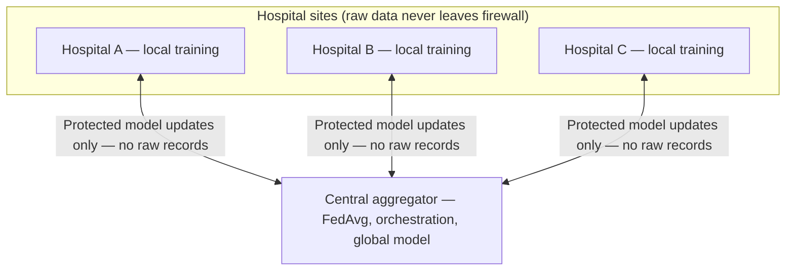
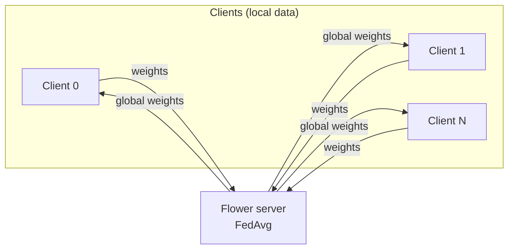
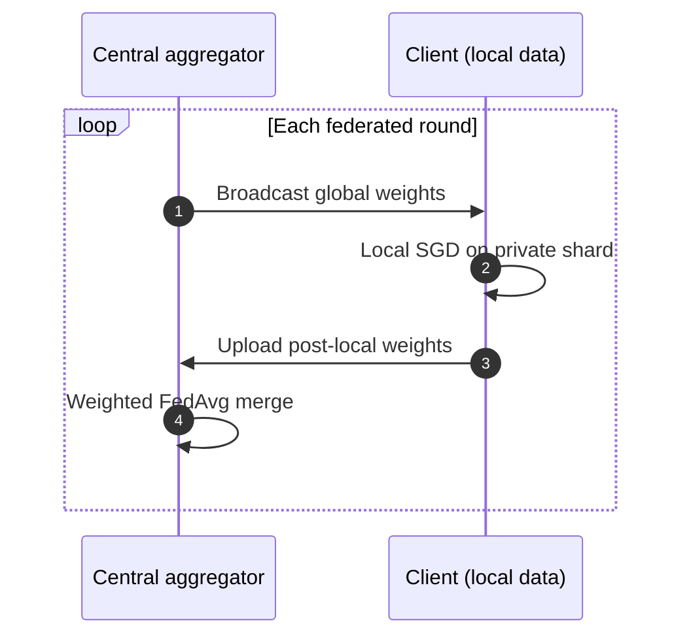

<div align="center">

# Prism-Federated

### *Privacy-Preserving Distributed Intelligence for Sensitive Data Silos.*

### Runnable lab — **FedAvg** on MNIST with **Flower** + **PyTorch**

[](https://www.python.org/)
[](https://pytorch.org/)
[](https://flower.ai/)

Train a **global model** without centralizing raw data: each client keeps a local MNIST shard; only **model weights** move over **gRPC** to the aggregator.

[Design & roadmap](plan.md) · [Vision](#vision--target-architecture) · [Quick start](#quick-start) · [MVP architecture](#mvp-architecture) · [Benchmark](#benchmark-mnist-cnn-mvp)

</div>

---

## Vision & target architecture

**Pitch.** In an era of strict data privacy (GDPR/HIPAA), the biggest hurdle for AI is not the algorithm—it is access to data. Prism-Federated is framed around training a **high-performance global model** on sensitive workloads (for example medical imagery) across **simulated** hospital sites, with **no raw patient data** crossing each site’s firewall—only **model updates** flow to a central aggregator. **This repository** currently implements a **small, reproducible FedAvg demo on MNIST**; the bullets below describe the **intended** differentiators for decks and roadmap alignment.

**Key features to highlight**

| Theme | Intent |
|:---|:---|
| **FedAvg + straggler mitigation** | Custom orchestration so one slow “hospital” (client) does not stall an entire round—partial participation, timeouts, and related policies (see [plan.md](plan.md)). |
| **Differential privacy (DP)** | Rényi differential privacy (RDP): calibrated noise on updates so the global model is harder to reverse-engineer toward individual training points. |
| **Heterogeneous data (“Prism”)** | A decomposition / personalization strategy so nodes adapt to **local** label or feature skew while still feeding a shared **foundation** model. |

**Privacy budget (roadmap).** Future iterations will implement **(ε, δ)-differential privacy** (with **Rényi / moments accountant** tracking where appropriate) so each round consumes a defined slice of a cumulative **privacy budget**: the released global model stays within a strict, auditable bound on how much information about **any single** training point can leak through weights and aggregates.

**Target topology** (slides / threat-model narrative): encrypted transport and optional secure aggregation belong in a **production** deployment; the MVP uses **cleartext gRPC on localhost** for a safe lab default.

**Why gRPC (Flower default)?** Federated rounds move **large float tensors** (full model weights). **gRPC over Protocol Buffers** gives compact binary framing and efficient streaming compared to typical **REST + JSON** patterns, which re-serialize weights as text-heavy payloads and add per-request overhead—meaningful when many clients participate or bandwidth is constrained.



*Deck shorthand once **TLS** (and optionally **secure aggregation**) is deployed: **encrypted weights only**—no raw patient imagery or identifiers on the wire.*

**Vision vs this repository**

| Capability | Target vision | This repo today |
|:---|:---|:---|
| **Non-IID data & label skew** | Real sites disagree in prevalence (e.g. Hospital A: mostly “healthy” imaging, Hospital B: mostly positive cases)—a core FL failure mode; **Prism**-style local–global decomposition to personalize without abandoning the shared trunk | **IID** MNIST shards (uniform label mix per client); pathological / Dirichlet skew is roadmap ([plan.md](plan.md)) |
| Stragglers | Mitigated via policy (e.g. `fraction_fit` &lt; 1, timeouts) | All clients required each round (`fraction_fit=1.0`) |
| Privacy of updates | TLS, optional SecAgg/MPC, RDP / (ε, δ) accounting | Cleartext localhost gRPC; no DP in code |
| Personalization | Local adapters or split heads on top of a shared foundation | Single shared CNN; no per-site head |

---

## Highlights

| | |
|:---|:---|
| **Transport** | **gRPC** + Protobuf (Flower): efficient binary serialization for weight tensors vs typical REST/JSON stacks |
| **Aggregation** | Sample-weighted **FedAvg** (client sample counts drive the global mean) |
| **Algorithm / model** | Federated Averaging; lightweight **MNIST CNN** |
| **Topology** | 1 Flower server + *N* independent client processes (no Ray required) |
| **Data partitioning** | Deterministic **IID** shards by index range; parent pre-downloads MNIST once to avoid parallel download races |
| **Scalability (lab)** | Multi-process simulation scales to *N* virtual nodes on one machine |
| **Networking** | Ephemeral `127.0.0.1` port by default — safe for repeated local runs |

---

## MVP architecture



1. Server broadcasts global parameters.  
2. Each client runs **local SGD** on its shard.  
3. Clients upload updated weights; server **aggregates** and starts the next round.

**Local vs global training loop** (one federated round):



---

## Repository layout

```
Prism-Federated/
├── LICENSE                ← Apache 2.0
├── README.md              ← you are here
├── plan.md                ← system design & roadmap
├── requirements.txt
├── run_federated.py       ← entrypoint: server + N clients
├── scripts/
│   └── benchmark_mvp.py   ← reproducible centralized vs in-process FedAvg numbers
└── fed_ml/
    ├── model.py           ← MNIST CNN
    ├── data.py            ← MNIST shards + ensure_mnist_downloaded()
    └── client.py          ← Flower NumPyClient
```

---

## Quick start

```bash
git clone https://github.com/vgandhi1/Prism-Federated.git
cd Prism-Federated

# 1. Create and activate a virtual environment
python3 -m venv .venv
source .venv/bin/activate          # Windows: .venv\Scripts\activate

# 2. Install dependencies (we highly recommend `uv` for 10-100x faster installation)
pip install -r requirements.txt    # Or: uv pip install -r requirements.txt

# 3. Run the simulation
python run_federated.py --num-clients 3 --num-rounds 2
```

**First run** downloads MNIST into `./data` (internet required). Later runs are offline-friendly once data exists.

### Useful flags

| Flag | Default | Description |
|:---|:---|:---|
| `--num-clients` | `3` | Virtual clients / parallel processes |
| `--num-rounds` | `2` | Federated rounds |
| `--batch-size` | `64` | Local training batch size |
| `--local-epochs` | `1` | SGD epochs per client per round |
| `--server-address` | *(ephemeral)* | e.g. `127.0.0.1:8080` if you need a fixed port |
| `--startup-delay` | `2.0` | Seconds to wait after server start before clients connect |

---

## What you should see

Flower logs rounds, fit/evaluate traffic, and a short summary. At the end, you should see the loss decreasing:

`Run finished 2 round(s) … History (loss, distributed): round 1: 0.083 … round 2: 0.048 …`

> [!NOTE]
> You will likely see verbose **deprecation warnings** from Flower (`WARNING: DEPRECATED FEATURE: flwr.server.start_server() ...`). 
> **These are completely harmless and expected.** The MVP currently relies on Flower's legacy simulation APIs (`start_server` / `start_numpy_client`) for simplicity and will be migrated to the new `flower-superlink` architecture in a future update (see [plan.md](plan.md)).

**Optional polish:** a short terminal recording saved as `docs/demo.gif` (or linked video) makes the multi-client startup easy to preview in the GitHub UI.

---

## Benchmark (MNIST CNN MVP)

Apples-to-apples **accuracy** comparison on the **full MNIST test set**, with **wall time** for the training loops only (excludes Flower process spawn and gRPC). The federated column uses an **in-process FedAvg** simulator that matches this repo’s **shards, optimizer, and epochs-per-round**—so numbers isolate *data geometry* and *aggregation*, not network jitter.

```bash
# from repo root, with dependencies installed
python scripts/benchmark_mvp.py
```

**Reference run** (Python 3.12, **CPU**, `torch.manual_seed(42)`, 10 epochs centralized vs 10 FedAvg rounds, 3 clients, 1 local epoch per round, batch size 64, SGD `lr=0.01` / `momentum=0.9`):

| Strategy | Schedule | Wall time | Test accuracy | Raw training data |
|:---|:---|---:|---:|:---|
| **Centralized** | 10 full passes over pooled MNIST train | 1.00× (~116 s) | **99.11%** | Held in **one** process |
| **Federated (simulated)** | 10 rounds × 3 IID clients × 1 local epoch | **1.02×** (~119 s) | **99.17%** | **Sharded** (never sent to aggregator) |

*Federated wall time here runs clients **sequentially** in one Python process; a real Flower job overlaps clients but adds serialization and server orchestration—see `run_federated.py` for the distributed path.*

**Privacy narrative (MVP vs centralized).** Centralized training **pools** all examples in one address space. Federated training keeps **raw examples on client shards** and exchanges **weight tensors** only—appropriate for the “data never leaves the hospital firewall” story, with TLS / SecAgg / DP still required for a production threat model ([vision](#vision--target-architecture)).

---

## Scope & non-goals (MVP)

**In scope:** cleartext lab gRPC on localhost, IID MNIST, FedAvg.

**Out of scope for now:** TLS/mTLS, secure aggregation (MPC), differential privacy (Opacus), Kubernetes, poisoning defenses, medical imaging pipelines. Roadmap detail lives in [plan.md](plan.md); the [vision](#vision--target-architecture) section above states how those items relate to demos vs. production narrative.

---

## License

Licensed under the **Apache License 2.0** — see [LICENSE](LICENSE).

---

<div align="center">

**Prism-Federated** · Federated learning without moving raw data

</div>
