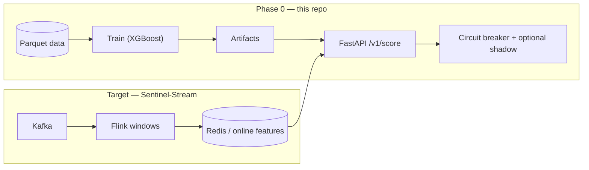

<div align="center">

# Sentinel-Stream

### A high-throughput, sub-100ms ML engine for real-time financial defense

**Kappa-style streaming design** · **Apache Flink** stateful windows (roadmap) · **Shadow** challenger scoring · **Circuit breaker** heuristic fallback · **FastAPI** + **XGBoost** today

<p>
  <a href="https://www.python.org/downloads/"></a>
  
  
  
  
</p>

<p>
  <a href="https://github.com/vgandhi1/Sentinel-Stream"><strong>github.com/vgandhi1/Sentinel-Stream</strong></a>
</p>

[**Quick start**](#quick-start) · [**Pitch**](#pitch-for-the-viewer) · [**Key features**](#key-features) · [**API**](#http-api) · [**MLOps**](#mlops--governance) · [**System design →**](./plan.md)

<br/>

</div>

---

## Pitch for the viewer

🚀

> While most fraud detection models are built for batch processing, **Sentinel-Stream** is built for the **moment of transaction**. It solves the critical **cold-start feature** problem: how do you know a user has made five purchases in the last ten minutes if your database has not updated yet? Using a **Kappa architecture**, this system is designed to **process, aggregate, and score** in **under ~60ms** on the inference hop (validate under your own SLO and hardware).

---

## Key features

| Capability | What you get |
| --- | --- |
| **Shadow mode** | Optional **challenger** model directory (`SENTINEL_SHADOW_ARTIFACTS_DIR`). Live responses include `shadow_fraud_probability` for comparison; **production `decision` stays on the champion** until you promote. |
| **Stateful sliding windows** | **Apache Flink** (or Flink SQL / ksqlDB) in the **target architecture** maintains a living user profile—velocity, geo-divergence, session aggregates—updated every event. **Phase 0** uses Parquet columns to simulate aggregates; see [`plan.md`](./plan.md). |
| **Circuit breaker** | If ML inference exceeds **`SENTINEL_CIRCUIT_THRESHOLD_MS`** (default **60**), the API switches to a **high-speed heuristic** so the payment path does not block on model latency. Response includes `circuit_breaker_state`: `closed` (ML) or `open` (heuristic). |

---

## Why this project

| | |
| :---: | :--- |
| **Speed** | Score in **milliseconds** on a laptop; circuit breaker protects tail latency. |
| **Clarity** | One repo: data → train → **artifacts** → **HTTP score** + optional **MLflow** runs. |
| **Trust** | Promotion **YAML** gate, **model card** template, shadow signal **without** changing customer decisions. |

---

## Table of contents

1. [Pitch for the viewer](#pitch-for-the-viewer) · [Key features](#key-features) · [Why this project](#why-this-project)  
2. [Architecture at a glance](#architecture-at-a-glance)  
3. [Quick start](#quick-start)  
4. [Try the API](#try-the-api)  
5. [Technical stack](#technical-stack)  
6. [Project layout](#project-layout)  
7. [Data & features](#data--features)  
8. [Training & evaluation](#training--evaluation-cli)  
9. [MLOps & governance](#mlops--governance)  
10. [HTTP API](#http-api)  
11. [Configuration](#configuration)  
12. [Troubleshooting](#troubleshooting)  
13. [Metrics, security, related docs](#metrics-security-related-docs)  

---

## Architecture at a glance



---

## Quick start

**Clone** (this repository is the project root):

```bash
git clone https://github.com/vgandhi1/Sentinel-Stream.git
cd Sentinel-Stream
```

Then from the repo root:

```bash
python3 -m venv .venv
source .venv/bin/activate          # Windows: .venv\Scripts\activate
pip install -r requirements.txt

python scripts/generate_data.py
python -m src.train
python -m src.evaluate

uvicorn api.main:app --host 127.0.0.1 --port 8000
```

**MLflow (optional):**

```bash
python -m src.train --mlflow --mlflow-experiment sentinel_stream_classifier
mlflow ui --backend-store-uri "file:$(pwd)/mlruns"
```

---

## Try the API

```bash
curl -s http://127.0.0.1:8000/health

curl -s -X POST http://127.0.0.1:8000/v1/score \
  -H "Content-Type: application/json" \
  -d '{
    "amount": 120.0,
    "hour_of_day": 14,
    "days_since_last_txn": 1.5,
    "txn_count_24h": 3,
    "distinct_merchants_24h": 2,
    "avg_amount_7d": 95.0,
    "channel_online": 0
  }'
```

Open **docs:** [http://127.0.0.1:8000/docs](http://127.0.0.1:8000/docs)

---

## Technical stack

### Phase 0 (implemented)

| Layer | Technology |
| --- | --- |
| ML | **XGBoost**, **scikit-learn** |
| Data | **Pandas**, **PyArrow**, **NumPy** |
| API | **FastAPI**, **Pydantic v2**, **Uvicorn** |
| Resilience | **Heuristic fallback** + latency **circuit breaker**; optional **shadow** bundle |
| MLOps | **MLflow**, **promotion_policy.yaml**, CI workflow |

### Target production (see [`plan.md`](./plan.md))

| Concern | Typical stack |
| --- | --- |
| Events | **Kafka** |
| Stateful windows | **Apache Flink** |
| Online features | **Redis** / DynamoDB |
| Serving at scale | Triton, BentoML, or autoscaled FastAPI |

---

## Project layout

<details>
<summary><strong>Expand tree</strong></summary>

```
Sentinel-Stream/
├── README.md
├── plan.md
├── requirements.txt
├── scripts/
│   ├── generate_data.py
│   └── check_promotion.py
├── .github/workflows/
│   └── sentinel-stream-mlops.yml
├── mlops/
├── src/
│   ├── config.py
│   ├── train.py
│   ├── mlflow_tracking.py
│   ├── evaluate.py
│   └── heuristic_fallback.py
└── api/
    └── main.py
```

</details>

---

## Data & features

Default: **`data/transactions.parquet`**. Label: **`is_fraud`**.

| Field | Role |
| --- | --- |
| `amount`, `hour_of_day`, `days_since_last_txn` | Amount & time context |
| `txn_count_24h`, `distinct_merchants_24h`, `avg_amount_7d` | Velocity / behavior proxies |
| `channel_online` | Channel flag |

Bring your own Parquet (same columns): `python -m src.train --data /path/to/data.parquet`

---

## Training & evaluation (CLI)

| Step | Command |
| --- | --- |
| Generate | `python scripts/generate_data.py` — optional: `--n-legit`, `--n-fraud`, `--seed` |
| Train | `python -m src.train` — optional: `--data`, `--seed`, `--target-fpr`, `--artifacts` |
| MLflow | `python -m src.train --mlflow` — optional: `--mlflow-experiment`, `--mlflow-tracking-uri`, `--no-mlflow` |
| Evaluate | `python -m src.evaluate` — optional: `--data`, `--artifacts` |
| Promotion gate | `python scripts/check_promotion.py` — optional: `--metadata`, `--policy` (defaults: `artifacts/metadata.json`, `mlops/promotion_policy.yaml`) |

Training writes **`artifacts/lineage.json`** (CI/git metadata when present — no customer PII).

---

## MLOps & governance

| Item | Link / command |
| --- | --- |
| Runbook | [`mlops/README.md`](./mlops/README.md) |
| Promotion gate | `python scripts/check_promotion.py` |
| Model card template | [`mlops/model_card_template.md`](./mlops/model_card_template.md) |
| CI | [`.github/workflows/sentinel-stream-mlops.yml`](./.github/workflows/sentinel-stream-mlops.yml) — runs on push/PR to `main` / `master` |
| Local MLflow + Postgres | `docker compose -f mlops/docker-compose.mlflow.yml up -d` |

---

## HTTP API

| Method | Path | Purpose |
| --- | --- | --- |
| `GET` | `/health` | Liveness |
| `POST` | `/v1/score` | Champion score + `decision` + circuit + optional shadow |

**Example response**

```json
{
  "fraud_probability": 0.12,
  "decision": "approve",
  "threshold": 0.25,
  "circuit_breaker_state": "closed",
  "shadow_fraud_probability": 0.09
}
```

`shadow_fraud_probability` is omitted when no shadow bundle is configured (`response_model_exclude_none`).

---

## Configuration

| Variable | Purpose |
| --- | --- |
| `SENTINEL_ARTIFACTS_DIR` | Champion model directory (defaults to `./artifacts`). **`FRAUD_ARTIFACTS_DIR`** still accepted for compatibility. |
| `SENTINEL_SHADOW_ARTIFACTS_DIR` | Optional second artifact dir for **shadow** scoring only. |
| `SENTINEL_CIRCUIT_THRESHOLD_MS` | ML latency budget before heuristic (default **60**). |
| `SENTINEL_FORCE_CIRCUIT_OPEN` | `true` / `1` to always use heuristic (**testing only**). |
| `SENTINEL_INJECT_LATENCY_MS` | Injected delay before ML predict (**testing only**; never in prod). |

---

## Troubleshooting

<details>
<summary><strong>Common fixes</strong></summary>

| Issue | Fix |
| --- | --- |
| Missing data | Run `python scripts/generate_data.py` or pass `--data` to train. |
| API 503 | Train first: `python -m src.train`. Check `SENTINEL_ARTIFACTS_DIR`. |
| Stale scores | Restart **Uvicorn** after retrain. |
| HTTP 422 | Validate JSON ranges (`hour_of_day` 0–23, `channel_online` 0–1). |
| Circuit always `open` | Check `SENTINEL_CIRCUIT_THRESHOLD_MS`; remove test-only inject/force flags. |
| `venv` shebang errors after moving the folder | Recreate the environment: `rm -rf .venv && python3 -m venv .venv && pip install -r requirements.txt`. |

</details>

---

## Metrics, security, related docs

- Prefer **PR-AUC** and fixed-**FPR** operating points over ROC-AUC alone on rare fraud.
- Do **not** send PANs, passwords, or raw tokens to the API; add **TLS**, **auth**, and **rate limits** before any production exposure.

| Doc | Content |
| --- | --- |
| [`plan.md`](./plan.md) | Full architecture, shadow/circuit/Flink narrative, roadmap |
| [`mlops/README.md`](./mlops/README.md) | MLflow, gates, Docker stack |
