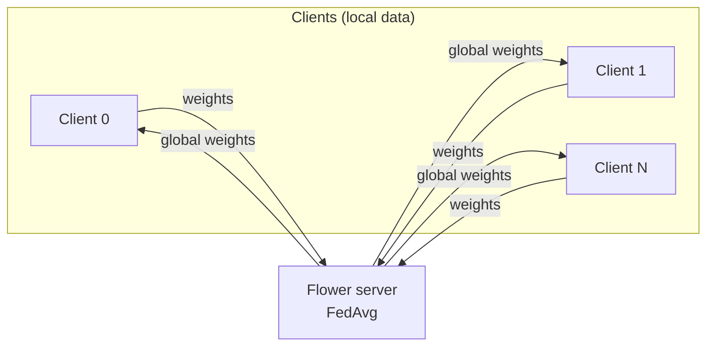

<div align="center">

# Prism-Federated

### Privacy-oriented federated learning — **FedAvg** on MNIST with **Flower** + **PyTorch**

[](https://www.python.org/)
[](https://pytorch.org/)
[](https://flower.ai/)

Train a **global model** without centralizing raw data: each client keeps a local MNIST shard; only **model weights** move over **gRPC** to the aggregator.

[Design & roadmap](plan.md) · [Quick start](#-quick-start) · [How it works](#-how-it-works)

</div>

---

## Highlights

| | |
|:---|:---|
| **Algorithm** | Federated Averaging (FedAvg), sample-weighted aggregation |
| **Model** | Lightweight CNN on MNIST |
| **Topology** | 1 Flower server + *N* independent client processes (no Ray required) |
| **Data** | IID shards; parent pre-downloads MNIST once to avoid parallel download races |
| **Networking** | Ephemeral `127.0.0.1` port by default — safe for repeated local runs |

---

## Architecture



1. Server broadcasts global parameters.  
2. Each client runs **local SGD** on its shard.  
3. Clients upload updated weights; server **aggregates** and starts the next round.

---

## Repository layout

```
Prism-Federated/
├── README.md              ← you are here
├── plan.md                ← system design & roadmap
├── requirements.txt
├── run_federated.py       ← entrypoint: server + N clients
└── fed_ml/
    ├── model.py           ← MNIST CNN
    ├── data.py            ← MNIST shards + ensure_mnist_downloaded()
    └── client.py          ← Flower NumPyClient
```

---

## Quick start

```bash
git clone https://github.com/vgandhi1/Prism-Federated.git
cd Prism-Federated

python3 -m venv .venv
source .venv/bin/activate          # Windows: .venv\Scripts\activate
pip install -r requirements.txt

python run_federated.py --num-clients 3 --num-rounds 2
```

**First run** downloads MNIST into `./data` (internet required). Later runs are offline-friendly once data exists.

### Useful flags

| Flag | Default | Description |
|:---|:---|:---|
| `--num-clients` | `3` | Virtual clients / parallel processes |
| `--num-rounds` | `2` | Federated rounds |
| `--batch-size` | `64` | Local training batch size |
| `--local-epochs` | `1` | SGD epochs per client per round |
| `--server-address` | *(ephemeral)* | e.g. `127.0.0.1:8080` if you need a fixed port |
| `--startup-delay` | `2.0` | Seconds to wait after server start before clients connect |

---

## What you should see

Flower logs rounds, fit/evaluate traffic, and a short summary. Example line:

`Run finished 2 round(s) … History (loss, distributed): round 1: … round 2: …`

You may see **deprecation warnings** from Flower for `start_server` / `start_numpy_client`; the MVP still uses the legacy API for simplicity. See [plan.md](plan.md) roadmap for migration options.

---

## Scope & non-goals (MVP)

**In scope:** cleartext lab gRPC on localhost, IID MNIST, FedAvg.

**Out of scope for now:** TLS/mTLS, secure aggregation (MPC), differential privacy (Opacus), Kubernetes, poisoning defenses, medical imaging pipelines. These are captured in [plan.md](plan.md).

---

## License

Specify your license here (e.g. MIT) when you choose one.

---

<div align="center">

**Prism-Federated** · Federated learning without moving raw data

</div>
